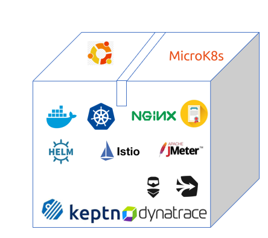
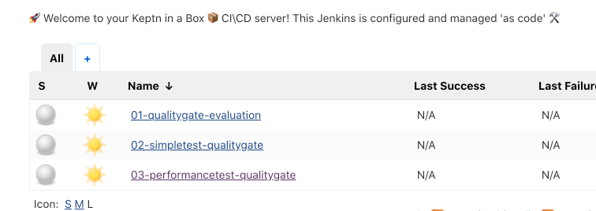
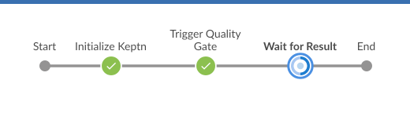
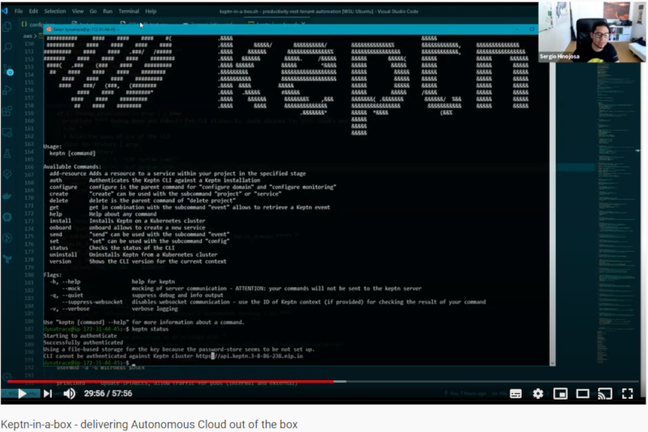
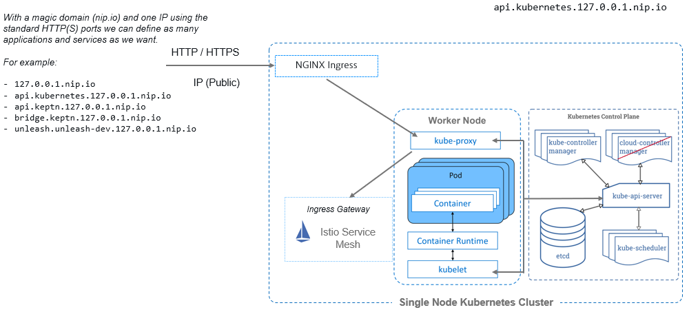

> **DISCLAIMER**: This project was developed for educational purposes only and is not complete, nor supported. It's publishment is only intended for helping others automate environments for delivering workshops with Keptn & Dynatrace. Even though the exposed endpoints of this cluster have valid SSL certificates generated with Cert-Manager and Let's Encrypt, does not mean the Box is secure.    

> ## ***🥼⚗ Spend more time innovating and less time configuring***

# Keptn-in-a-Box (with Dynatrace Software Intelligence empowered) 🎁

Keptn-In-A-Box is part of the automation for delivering Autonomous Cloud Workshops with Dynatrace. This is not a tutorial but more an explanation of what the shell file set up for you on a plain Ubuntu image. 

A simple Bash script will set-up a fully functional Single Node Kubernetes Cluster with Dynatrace installed and Kubernetes Cluster, Cloud Applications and Events monitoring enabled. This script is used as [userdata](https://docs.aws.amazon.com/AWSEC2/latest/UserGuide/user-data.html) when spinning up elastic compute images (ec2) in amazon web services, but it can run also manually in a Linux machine or VM with snap installed. The tested distro is  *Ubuntu Server 18.04 LTS & 20.04 LTS*
For spinning up instances automatically with AWS completely configured and set up, and also automating the creation and management of Dynatrace environments, take a look at this project- [Dynatrace - Rest Tenant Automation](https://github.com/sergiohinojosa/Dynatrace-REST-Tenant-Automation) 


## 🥜Keptn-in-a-Box - Features in a Nutshell
- Update the ubuntu repository
- Installation of Docker (for building own Docker images)
- Installation of Microkubernetes
- Allow the Kube-API to run priviledged pods (necessary for deploying the FullStack Agent via Operator)
- Update IPTABLES: allowing traffic for pods internal and external
- Set up of useful BASH Aliases for working with the command line
- Enable autocompletion of Kubectl
- Installation of Dynatrace ActiveGate and configuration of [Cluster](https://www.dynatrace.com/support/help/technology-support/cloud-platforms/kubernetes/monitoring/connect-kubernetes-clusters-to-dynatrace/) and [Workload monitoring](https://www.dynatrace.com/support/help/technology-support/cloud-platforms/kubernetes/monitoring/monitor-workloads-kubernetes/)
- Installation of Istio 1.5.1 
- Installation of Helm Client
- Enabling own Docker Registry for the Cluster
- Convert the public IP in a (magic) domain ([nip.io](https://nip.io/)) for being able to expose all the needed services with subdomains.
- Routing of traffic to Istio-Ingressgateway via a Kubernetes NGINX Ingress using standard HTTP(S) ports 80 and 443. This way we dont need a public IP from the Cloud Provider
- Installation of Keptn (QualityGates also available)
- Expose the Keptn-Bridge Service
- Installation of Dynatrace OneAgent via Keptn
- Deployment of Jenkins preconfigured und managed as code
- Deployment of the Unleash-Server
- Onboard of the Sockshop-Carts Sample project
- Deployment of a cartsloadgenerator PoD
- Deployment of a Autonomous Cloud teaser home page with links to the pipeline, kubernetes api, keptn-bridge, keptn-api, jenkins 
- Creation of valid SSL certificates for the exposed endpoints with Certmanager and HTTPs Let's encrypt.
- Create a user account and copy the standard user (ubuntu on this case) with his own home directory (a replica) and allowing SSH connections with text password. Useful for spinning an army of workshop clusters. 

### 💻The Keptn-in-a-Box Bash installation

<table>
  <tr>
    <td>
    <p>
    The bash file is scripted in a modular fashion allowing you with  control flags to enable or disable the modules that you want to install in your box. This allows you to have a very slim cluster running keptn with the bare minimal resources or to have a full blown cluster with pretty much all the desired features and frameworks for your CI/CD pipelines and performance testings.
    <ol>
    <li><a href="keptn-in-a-box.sh">keptn-in-a-box.sh</a></li>
    <li><a href="functions.sh">functions.sh</a></li>
    </ol>  
    </p>
    </td>
    <td>
       
    </td>
  </tr>
</table>


## 📚Tutorial
For a step by step understanding of how Keptn-in-a-Box works and how to use it, take a look at the Keptn in a Box tutorial [https://tutorials.keptn.sh/tutorials/keptn-in-a-box/)](https://tutorials.keptn.sh/tutorials/keptn-in-a-box-07)


## Prerequisites

- [Ubuntu](https://ubuntu.com/#download) with internet connection (tested on 18.04 LTS and 20.04 LTS)

#### (optional)
- [A Dynatrace Tenant](https://www.dynatrace.com/trial/) 
- AWS Account [Here you can get a free account](https://aws.amazon.com/free/)
- You will get the most out of it if your DOMAIN is configured and reachable either by Dynatrace SaaS or Dynatrace Managed.

## Repository Structure
```bash
─ doc                       doc folder.
─ keptn-in-a-box.sh         the executable (also where to define your variables)
─ functions.sh        		The definiton of functions and modules 
─ resources                 
  ├── cartsloadgenerator    Sources of the load container of the carts app 
  ├── demo                  Scripts for Onboarding the Carts app  
  ├── dynatrace             Scripts for integrating with Dynatrace
  ├── homepage              Sources of the homepage for displaying the Autonomous Cloud teaser  
  ├── ingress               Files and logic for mapping, exposing the endpoints and services. Creation of Certificates.  
  ├── jenkins               Deployment and configuration for Jenkins managed as code.
  ├── misc                  Miscelaneous (patch kubernetes dashboard)
  └── virtualservices       YAML files for virtualservices 
```

## 💾 Sizing

This section will give you an idea the nedded size for your Box. But it all dependson the modules you want to install and what is your goal and usecase.
The installer comes with 3 predefined modules: **minimal**, **default** and **full**. 

### 🕐 Installation time
From the testing in AWS minimal installation takes ~ 4 minutes to complete and full ~ 8 minutes. 

### AWS sizings for reference 
Below is a table for the sizing reference if you run a local VM or are virtualizing locally.

| **Size**   | **vCPUs** | **Memory (GiB)** |
| ---------- | --------- | ---------------- |
| t2.medium  | 2         | 4                |
| t2.large   | 2         | 8                |
| t2.xlarge  | 4         | 16               |
| t2.2xlarge | 8         | 32               |

### installationBundleKeptnOnly
The minimum required for running a Single Node Kubernetes cluster with keptn full features is a t2.medium (2 vCPU and 4 Gib of RAM) and 10 Gigabytes of disk space. If you feel frisky go for this size but the experience won't be the best. 

Adding more RAM and more CPUs will speed up things. Depending what you want to achieve. Also consider that you'll have available less than 2 Gigs of disk space. This is the available disk after a minimal installation.

```bash
df -h /
Filesystem      Size  Used Avail Use% Mounted on
/dev/root        20G  5.8G   14G  30% /
```


### installationBundleDemo
The minimum required for running the default modules is t2.large with 13 Gigs of Disk space. We recommend 20 Gigs and t2.xlarge for the best experience.

### installationBundleAll
The minimum required for running the default modules is t2.large with 13 Gigs of Disk space.We recommend 20 Gigs and t2.2xlarge for the best experience.

## Get started in 1 - 2 - 3

### Run it in an available machine  (manually)

#### 1. Log in into  your Ubuntu image
#### 2. Clone the repo and navigate to the directory

```bash
git clone https://github.com/keptn-sandbox/keptn-in-a-box ; cd keptn-in-a-box
```

> You can also specify a specific release like 'git clone --branch release-0.7.3 https://github.com/keptn-sandbox/keptn-in-a-box.git' the master branch will be pointing to the actual release.
> Actually you only need to copy and execute the **keptn-in-a-box.sh** file. It'll take care of the rest and load the resources from github.

#### 3. Execute the file with sudo rights.
```bash
sudo bash -c './keptn-in-a-box.sh &'
```
And that was it! Yes that easy!  Now if you notice is that there is an & in the command. This command will run installation in a bash shell as sudo, will prompt you for the password and will send the job to the background. You will not see any output since stdout and stderr are piped to a logfile which is located by default in **/tmp/install.log** 

For inspecting the installation on realtime type:
```bash
less +F /tmp/install.log
```

#####  The installed modules

The default installation is **installationBundlesDefault** which sets the control flag to true to the following modules:


```bash
  update_ubuntu=true
  docker_install=true
  microk8s_install=true
  setup_proaliases=true
  enable_k8dashboard=true
  istio_install=true
  helm_install=true
  keptn_install=true
  keptn_examples_clone=true
  resources_clone=true
  resources_route_istio_ingress=true
  dynatrace_savecredentials=true
  dynatrace_configure_monitoring=true
  dynatrace_activegate_install=true
  dynatrace_configure_workloads=true
  keptn_bridge_eap=true
  keptndemo_teaser_pipeline=true
  keptndemo_cartsload=true
  keptndemo_unleash=true
  keptndemo_cartsonboard=true
  microk8s_expose_kubernetes_api=true
  microk8s_expose_kubernetes_dashboard=true
```

Dynatrace OneAgent and Dynatrace ActiveGate will be installed and configured if you provided your credentials. Otherwise they won't be installed. 

The script will install all the modules shown above and the github repository will be cloned in the home (~) directory of the sudo user that executed the script.

>The script was first created  to be run as root without an interactive shell since it is passed as userdata on creation of the elastic cloud machine via a python rest automation program.

## 💪Empower your Keptn-in-a-box 🎁 with Dynatrace by adding it's credentials

- Add the Dynatrace information to the variables:

	- TENANT="https://mytenant.live.dynatrace.com"
	- PAASTOKEN=myDynatracePaaSToken
	- APITOKEN=myDynatraceApiToken

     > For Tenant add it with protocol like:
     >  *https://{your-domain}/e/{your-environment-id}* 
     > for managed or 
     > https://{your-environment-id}.live.dynatrace.com 
     > for SaaS


Generate an API token and a PaaS token in your Dynatrace environment.
Make sure you have the **Access problem and event feed, metrics, and topology** switch enabled for the API token.

For more details on the Integration with Dynatrace read the following links:
- [OneAgent Operator](https://www.dynatrace.com/support/help/technology-support/cloud-platforms/kubernetes/oneagent-with-helm/)
- [API Authentication](https://www.dynatrace.com/support/help/extend-dynatrace/dynatrace-api/basics/dynatrace-api-authentication/)
- [PaaS Token](https://www.dynatrace.com/support/help/reference/dynatrace-concepts/environment-id/#anchor_paas)
- [Kubernetes Cluster Monitoring with Dynatrace](https://www.dynatrace.com/support/help/technology-support/cloud-platforms/kubernetes/monitoring/connect-kubernetes-clusters-to-dynatrace/)
- [Kubernetes Events](https://www.dynatrace.com/support/help/technology-support/cloud-platforms/kubernetes/monitoring/events/)
- [Kubernetes Workloads](https://www.dynatrace.com/support/help/technology-support/cloud-platforms/kubernetes/monitoring/monitor-workloads-kubernetes/)


With the **installationModulesDefault** or **installationModulesFull** Dynatrace is automatically installed if the credentials are configured.


## Other installation options
### Spin your preconfigured Keptn-in-a-box machines with userdata  (manually in aws)
1. Log in to AWS
2. Click on "Launch instance"
3. Select "Ubuntu Server [18|20].04 LTS (HVM) "
4. Choose your Instance Type "t2.xlarge" or 2xlarge recommended.
5. Select "Next - configure instance details"
6. In Configure Instance details - Advanced options (below) copy the keptn-in-a-box.sh file. (as string or drop it, doesn't matter). Remember to edit your file if you want to customize your box.
7. Review it and launch your instance.

### Spin your preconfigured Keptn-in-a-box machines  with userdata (automated)
- Description to be added. Please see the [Dynatrace Rest Tenant Automation project](https://github.com/sergiohinojosa/Dynatrace-REST-Tenant-Automation) for reference. The RTA project can spin as many instances as you want by providing a simple CSV file. It will also create and configure Dynatrace environments for each CSV entry, 😍 perfect for delivering workshops 👨‍💻. If you are interested in a workshop get in contact with us. 


## 🛠 Customizing your installation

The keptn-in-a-box project is highly customizable (obviously since it's a bashfile) below are some customizations that are the most used. All customizations can and should be done in the ** keptn-in-a-box.sh** file and not in the **functions.sh** file. This way you keep a nice delegation of tasks and functionality. 

### Change the installation Bundle
Comment out the Default and uncomment the installation type you want. For example for a Demo:

```bash
# ==================================================
#    ----- Select your installation Bundle -----   #
# ==================================================
# Uncomment for installing only Keptn 
# installationBundleKeptnOnly

# - Comment out if selecting another bundle
installationBundleDemo

# - Comment out if only want to install only the QualityGates functionality
#installationBundleKeptnQualityGates

# - Uncomment for installing Keptn-in-a-Box for Workshops
# installationBundleWorkshop

# - Uncomment below for installing all features
#installationBundleAll

# - Uncomment below for installing a PerformanceAsAService Box
#installationBundlePerformanceAsAService
```
This will install single node kubernetes cluster, keptn, k8 dashboard and expose the endpoints. It will also clone the examples, onboard the carts sample app and add a quality gate.  

### 🏁🚦Performance as a Service  (installationBundlePerformanceAsAService)
This scenario will create a Box for delivering Performance as a Service in an instant. It will install the QualityGates functionality of Keptn  (not installing the other Keptn services and/or components such as Istio). It will install Jenkins preconfigured and managed as Code with 3 example pipelines. You only need to Tag your service in Dynatrace and (if wanting to do a loadtest) provide the URL of your application do a sample Loadtest and validate it. 
If you want to learn more about Qualitygates and SRE Driven development, take a look at the following tutorial:
https://tutorials.keptn.sh/tutorials/keptn-progressive-delivery-dynatrace/

#### The sample pipelines
 

For example triggering the first quality gate and evaluating a service will look something like this:

 

> Info: The first launch of the pipeline wil fail since they need to be initialized and they need parameters to do so. it is ok, on the second run, it will ask you for your information.


1. 01-qualitygate-evaluation -  will do only the evaluation of the given service and timeframe
2. 02-simpletest-qualitygate - will do a simple multi-step test directly from Jenkins via HTTP and do the validation via keptn.
3. 03-performancetest-qualitygate - will do a Loadtest based on a simple JMeter script. 

### Change your own Domain
By default the Script will get the public ip and give it a magic domain with nip.io like ip=1.2.3.4 will become 1-2-3-4.nip.io. This way with an NGINX Ingress Keptn and all Istio and Kubernetes services are available with subdomains via the standard HTTP ports 443 and 80.

This example could apply if I want to run a box in a VirtualMachine in my home network:
```bash
DOMAIN=192.168.0.1.nip.io
```

### 🔒 Generate valid certificates with Lets Encrypt 

By adding/commenting out the following control flags, you'll install Certmanager. A Cluster Issuer will be added and a valid certificate with let's encrypt for your public endpoints will be created. This way the exposed Endpoints/Services like the  Keptn API, Homepage, or Kubernetes API will have a valid Certificate. The Certificate renewal will happen automatically.

```bash
certmanager_install=true
certmanager_enable=true
```

If you provide your Email, the Cluster issuer will be created with the given email account. If left empty a fake Email account will be generated.

```bash
CERTMANAGER_EMAIL="youremail@yourdomain.com"
```

Add the modules before the `doInstallation` 

### 👨‍💻 Create a Workshop user 
You might have notice the following variables:
```bash
NEWPWD="dynatrace"
NEWUSER="dynatrace"
```
This variables in combination with the control flag `create_workshop_user=false` will create a workshop user. It will clone the `USER` home directory and add hi configuration so the `NEWUSER` can also interact with `keptn`, `docker` and `kubectl`. An SSH Password will be configured and allowed.

###  Change the Version of a component
This are the actual versions of the different Modules
```bash
# **** Installation Versions **** 
# ==================================================
#      ----- Components Versions -----             #
# ==================================================
ISTIO_VERSION=1.5.1
CERTMANAGER_VERSION=0.14.0
KEPTN_VERSION=0.7.0
KEPTN_JMETER_SERVICE_VERSION=0.2.0
KEPTN_DT_SERVICE_VERSION=0.8.0
KEPTN_DT_SLI_SERVICE_VERSION=0.5.0
KEPTN_EXAMPLES_BRANCH=0.7.0
TEASER_IMAGE="shinojosa/nginxacm:0.7"
KEPTN_BRIDGE_IMAGE="keptn/bridge2:20200326.0744"
MICROK8S_CHANNEL="1.18/stable"
KEPTN_IN_A_BOX_DIR="~/keptn-in-a-box"
KEPTN_EXAMPLES_DIR="~/examples"
KEPTN_IN_A_BOX_REPO="https://github.com/keptn-sandbox/keptn-in-a-box"
KEPTN_IN_A_BOX_DIR="~/keptn-in-a-box"
KEPTN_EXAMPLES_DIR="~/examples"
```
Feel free to experiment and change the versions. We will try to keep the list up to date. 

###  Create your custom installation
At the begining of the  `functions.sh` file the installation modules are listed. You can enable them in the `keptn-in-a-box.sh` file before calling the `doInstallation` function.

### Troubleshooting and inspecting the installation
To Inspect do 

```bash
less +F /tmp/install.log
```
and to have a verbose output (of every executed command) set the following control flag `verbose_mode=true` 


## DeepDive into the project (understanding how Microk8s, NGINX Ingress routing, Istio and Keptn work together)

This project was first presented to the Keptn Community in a Keptn Developer Meeting on the 23rd of April 2020.

#### 📹Here is the recording of the Video: Keptn in a Box - Delivering Autonomous Cloud out of the Box
<a alt="Keptn in a Box - Delivering Autonomous Cloud out of the Box" href="https://www.youtube.com/watch?v=A9ZYdih0anE" target="_blank"></a>


Join the [Keptn Community](https://github.com/keptn/community) for more interesting projects and keep up to date with Keptn!


#### On a high level Kubernetes architecture this is how the setup of the Microkubernetes machine is setted up:


## Contributing
If you have any ideas for improvements or want to contribute that's great. Create a pull request or file an issue.

## Author 
sergio.hinojosa@dynatrace.com

