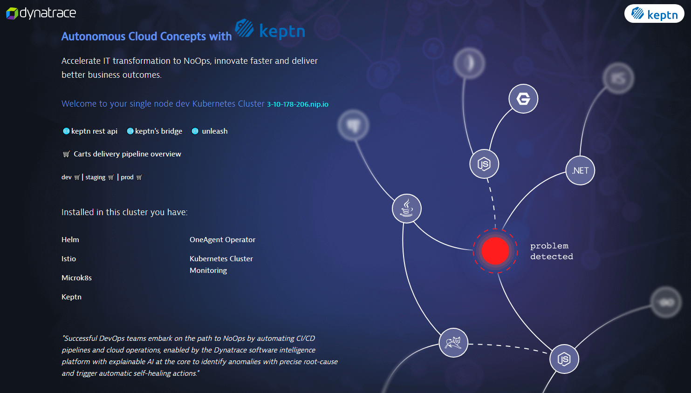

> **DISCLAIMER**: This project was developed for educational purposes only and is not complete, nor supported. It's publishment is only intended for helping others automate environments for delivering workshops with Keptn & Dynatrace. Even though the exposed endpoints of this cluster have valid SSL certificates generated with Cert-Manager and Let's Encrypt, does not mean the Box is secure.    

> ## ***🥼⚗ Spend more time innovating and less time configuring***

# Keptn in a Box (with Dynatrace enabled) 🎁

Keptn-In-A-Box is part of the automation for delivering Autonomous Cloud Workshops with Dynatrace. This is not a tutorial but more an explanation of what the shell file set up for you on a plain Ubuntu image. 

A simple Bash script will set-up a fully functional Single Node Kubernetes Cluster with Dynatrace installed and Kubernetes Cluster, Cloud Applications and Events monitoring enabled. This script is used as [userdata](https://docs.aws.amazon.com/AWSEC2/latest/UserGuide/user-data.html) when spinning up elastic compute images (ec2) in amazon web services, but it can run also manually in a Linux machine or VM with snap installed. The tested distro is  *Ubuntu Server 18.04 LTS*

## The Bash script in a nutshell
- Update the ubuntu repository
- Installation of Docker (for building own Docker images)
- Installation of Microkubernetes (v1.15)
- Allow the Kube-API to run priviledged pods (necessary for deploying the FullStack Agent via Operator)
- Update IPTABLES: allowing traffic for pods internal and external
- Create a user (dynatrace in this case) with it's own Home directory and SSH access for doing the Hands-On workshop
- Set up of useful BASH Aliases for working with the command line
- Enable autocompletion of Kubectl
- Installation of Dynatrace ActiveGate and configuration of [Cluster](https://www.dynatrace.com/support/help/technology-support/cloud-platforms/kubernetes/monitoring/connect-kubernetes-clusters-to-dynatrace/) and [Workload monitoring](https://www.dynatrace.com/support/help/technology-support/cloud-platforms/kubernetes/monitoring/monitor-workloads-kubernetes/)
- Installation of Istio 1.5.1 
- Installation of Helm Client
- Convert the public IP in a (magic) domain ([nip.io](https://nip.io/)) for being able to expose all the needed services with subdomains.
- Routing of traffic to Istio-Ingressgateway via a Kubernetes NGINX Ingress using standard HTTP(S) ports 80 and 443. This way we dont need a public IP from the Cloud Provider
- Installation of Keptn 
- Expose the Keptn-Bridge Service
- Installation of Dynatrace OneAgent via Keptn
- Deployment of the Unleash-Server
- Onboard of the Sockshop-Carts Sample project
- Deployment of a cartsloadgenerator PoD
- Deployment of a Autonomous Cloud teaser home page with links to the pipeline, bridge keptn-api. 

### The Bash File
- [keptn-in-a-box.sh](keptn-in-a-box.sh)

